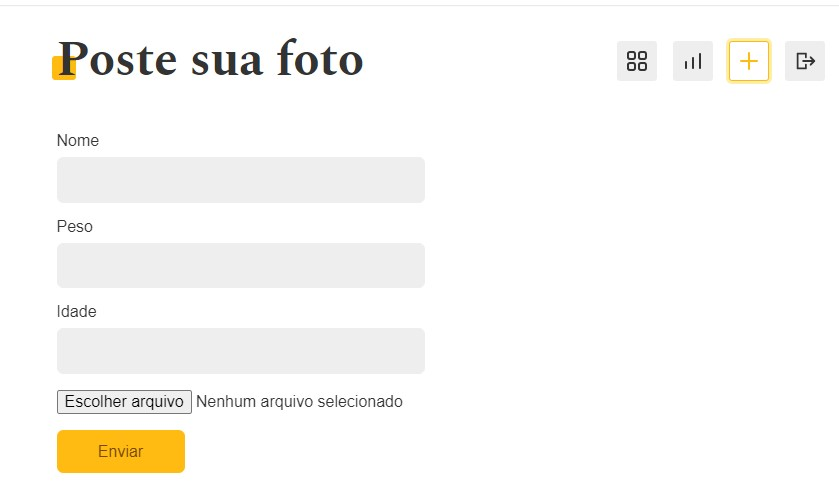

# dogs 
## Rede social para cachorros criada a partir do curso de React Completo da Origamid  
**_Jerry Macedo Castro_** | jerry.castro96@outlook.com

## Funcionamento
A aplicação permite que o usuario crie uma conta, poste fotos e comentrários em postagens. exist

  


## Tecnologias utilizadas
- React
- Javascript
- Context API
- CSS modules


## Iniciando o desenvolvimento

Após clonar o repositório instale as dependências

```bash
yarn 
# ou 
npm install
```

Para rodar o projeto

```bash
yarn start
# ou 
npm start
```

Abra o caminho http://localhost:3000 com o navegador e veja o resultado.
